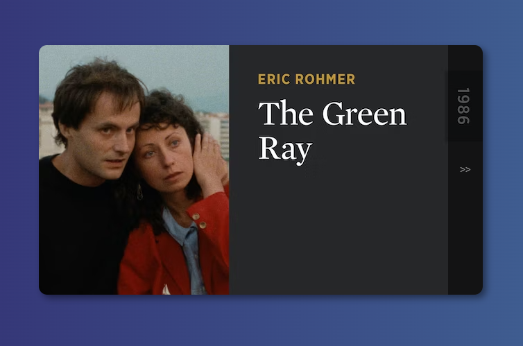

# Carrossel de Imagens

## Índice
- <a href="#tecnologias-utilizadas"> Tecnologias utilizadas </a>

## Funcionalidades do Projeto
- [x] Exibição de poster
- [x] Alterar imagem ao clicar nos botões\

## Layout

## Tecnologias Utilizadas
- HTML
- CSS
- Javascript